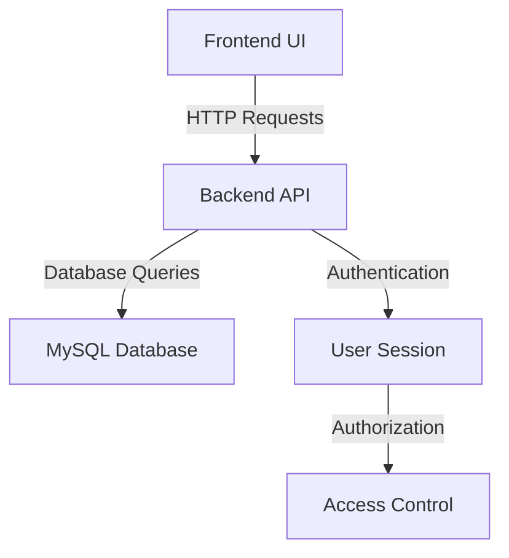

# 🏥 Hospital Consultation System

A modern web-based hospital consultation management system that streamlines the process of scheduling and managing medical consultations between patients and doctors.

## ✨ Features

- **👥 Patient Management**

  - Patient registration and profile management
  - Medical history tracking
  - Insurance information management
  - Emergency contact details

- **👨‍⚕️ Doctor Management**

  - Doctor profiles with specialization
  - Department-wise organization
  - Availability tracking
  - Status management (Active/Inactive/On Leave)

- **📅 Appointment Scheduling**

  - Real-time availability checking
  - Automated time slot management
  - Appointment status tracking
  - Consultation notes and documentation

- **📊 Dashboard**
  - Quick statistics overview
  - Recent notifications
  - Quick action cards
  - System status monitoring

## 🛠️ Tech Stack

### Frontend

- HTML5
- CSS3 (with Bootstrap 5)
- JavaScript (ES6+)
- Font Awesome for icons

### Backend

- Node.js
- Express.js
- MySQL2 (Promise-based)
- CORS enabled for cross-origin requests

## 📋 Prerequisites

- Node.js (v14 or higher)
- MySQL Server (v8.0 or higher)
- Modern web browser

## 🔄 Control Flow

### System Architecture



### Data Flow

1. **User Interface Layer**

   - Frontend components (HTML, CSS)
   - User interactions and form submissions
   - Real-time data updates

2. **Application Layer**

   - API endpoints handling
   - Business logic processing
   - Data validation and sanitization

3. **Data Layer**
   - Database operations
   - Data persistence
   - Query optimization

### Key Processes

1. **Appointment Booking Flow**

   ```mermaid
   sequenceDiagram
      participant User
      participant Frontend
      participant Backend
      participant Database

      User->>Frontend: Select Doctor & Date
      Frontend->>Backend: Get Available Slots
      Backend->>Database: Query Schedule
      Database-->>Backend: Return Slots
      Backend-->>Frontend: Display Slots
      User->>Frontend: Select Time Slot
      Frontend->>Backend: Create Appointment
      Backend->>Database: Save Appointment
      Database-->>Backend: Confirm Save
      Backend-->>Frontend: Show Success
   ```

2. **Patient Registration Flow**

   ```mermaid
   sequenceDiagram
      participant User
      participant Frontend
      participant Backend
      participant Database

      User->>Frontend: Fill Registration Form
      Frontend->>Frontend: Validate Input
      Frontend->>Backend: Submit Data
      Backend->>Backend: Process Data
      Backend->>Database: Create Patient
      Database-->>Backend: Confirm Creation
      Backend-->>Frontend: Return Success
      Frontend-->>User: Show Confirmation
   ```

## 🚀 Installation

1. Clone the repository:

   ```bash
   git clone https://github.com/yourusername/hospital-consultation.git
   cd hospital-consultation
   ```

2. Install backend dependencies:

   ```bash
   cd backend
   npm install
   ```

3. Configure the database:

   - Create a MySQL database named `hospitalsystem`
   - Update the database configuration in `backend/server.js`:
     ```javascript
     {
       host: "localhost",
       user: "your_username",
       password: "your_password",
       database: "hospitalsystem"
     }
     ```

4. Start the backend server:

   ```bash
   node server.js
   ```

5. Serve the frontend:
   - Use any static file server (e.g., Live Server in VS Code)
   - The frontend will be available at `http://localhost:5500`

## 🔌 API Endpoints

### Patients

- `GET /api/patients` - Get all patients
- `POST /api/patients` - Create new patient
- `PUT /api/patients/:id` - Update patient
- `DELETE /api/patients/:id` - Delete patient

### Doctors

- `GET /api/doctors` - Get all doctors
- `POST /api/doctors` - Create new doctor
- `PUT /api/doctors/:id` - Update doctor
- `DELETE /api/doctors/:id` - Delete doctor

### Appointments

- `GET /api/appointments` - Get all appointments
- `POST /api/appointments` - Create new appointment
- `POST /api/appointments/available-slots` - Get available time slots
- `PUT /api/appointments/:id` - Update appointment
- `DELETE /api/appointments/:id` - Cancel appointment

### Statistics

- `GET /api/doctors/count` - Get total doctor count
- `GET /api/patients/count` - Get total patient count
- `GET /api/appointments/count` - Get total appointment count

## 🔒 Security Features

- Input validation for all forms
- SQL injection prevention using parameterized queries
- CORS protection with specific origin whitelisting
- Error handling and logging
- Secure password handling

## 🤝 Contributing

1. Fork the repository
2. Create your feature branch (`git checkout -b feature/AmazingFeature`)
3. Commit your changes (`git commit -m 'Add some AmazingFeature'`)
4. Push to the branch (`git push origin feature/AmazingFeature`)
5. Open a Pull Request

## 📄 License

This project is licensed under the MIT License - see the [LICENSE](LICENSE) file for details.

## 🙏 Acknowledgments

- Bootstrap for the UI components
- Font Awesome for the icons
- MySQL for the database
- Express.js for the backend framework

## 💬 Support

For support, please open an issue in the GitHub repository or contact the development team.

## 📈 Version History

- 1.0.0
  - Initial release
  - Basic CRUD operations for patients and doctors
  - Appointment scheduling system
  - Dashboard with statistics
